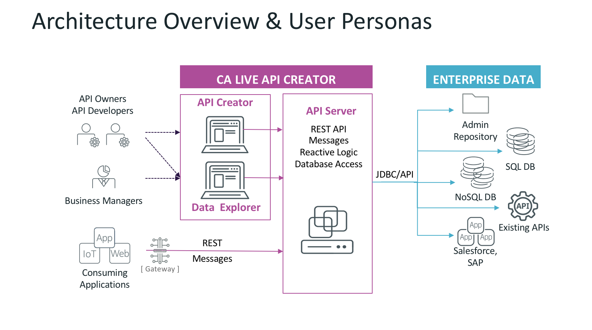

# CA Live API Creator Examples
This project contains multiple examples based on the CA Live API Creator application. 



## Installation
```aidl
1) git clone https://github.com/tylerm007/LAC_Training.git

2) Copy the 'teamspaces' directory to LAC_REPOSITORY_ROOT location.

3) Start LAC and logon as user: 'student1' password: 'Password1'
```

