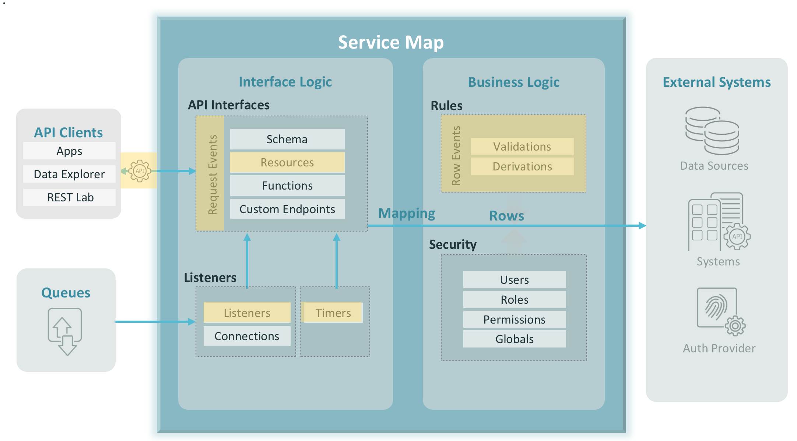

# Example using LAC Timers
Timers are pieces of code that get executed at specified points in time, or at specified intervals. 
Timers enable you to employ logic when there is no other "triggering event", such as an API call or a message.


## Installation
```aidl
1. Stop your LAC
2. Copy this examples folder to your ${LAC_REPOSITORY_HOME}/teamspaces/[teamspace_name]/apis directory
3. Start your LAC
4. Click on the Examples Timer API project
5. Find the Timers from the left menu and pin to the Favorites
```


