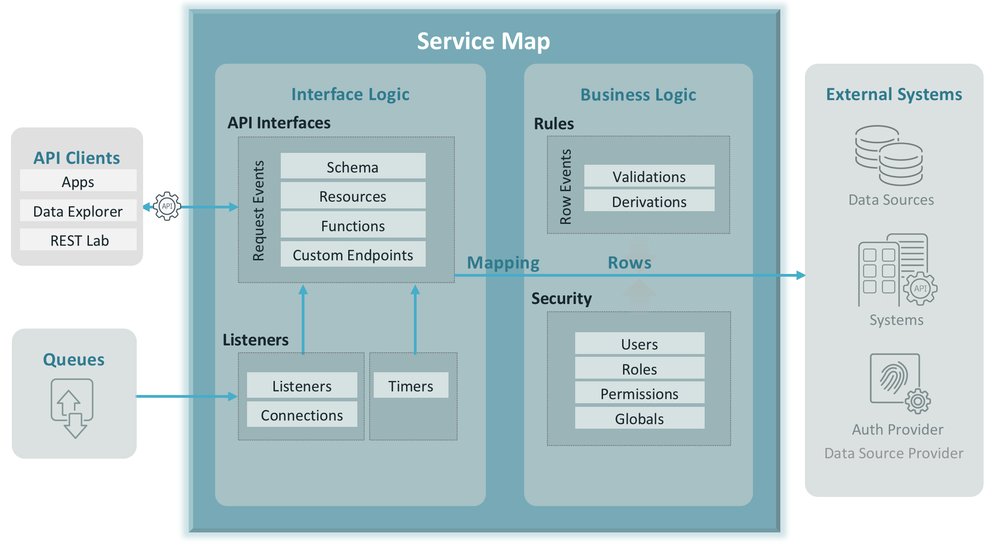

# Example using LAC Functions
Functions are user defined Endpoints that:
* May be associated with one or more tables, views and table-based resources
* Can have optional input parameters
* Should return a proper JSON response
* Are authenticated
* Are included in Swagger documentation

Functions are coded in JavaScript, with full access to the JavaScript libraries and Java JAR files. 
## JavaScript Function
You can define a named function endpoint (name must be unique accross other endpoints), with optional parameters. Functions are invoked like this: 
```
GET http://{host}:{port}/rest/default/{project_url}/v1/myJSFunction
```

)

## Installation
```aidl
1. Stop your LAC
2. Copy this examples folder to your ${LAC_REPOSITORY_HOME}/teamspaces/[teamspace_name]/apis
3. Start your LAC
4. Click on the Examples Function API project
```

