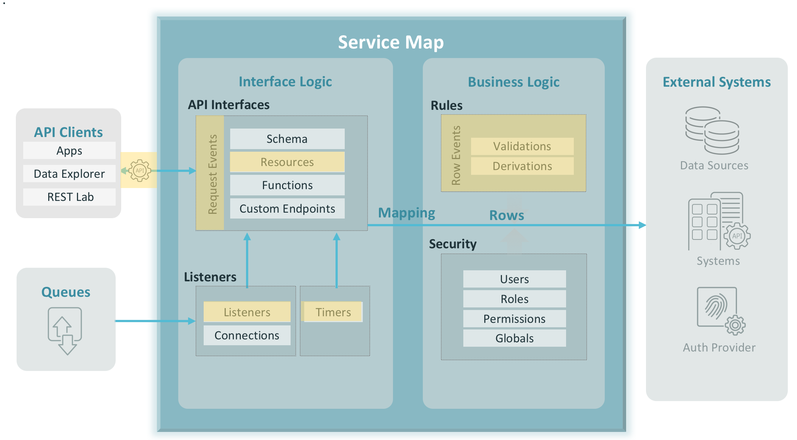

# Example using Rules
CA Live API Creator, business logic refers to the PUT/POST/DELETE-transactional business logic that 
CA Live API Creator applies when committing a transaction. 
The rules (your logic) are composed of multi-table derivation, constraint, and event rules. 
The rules govern update processing, using expressions instead of code.
## Rule Types
* Sum	Sums child attribute, optionally qualified
* Count	Counts child rows, optionally qualified
* Formula	Calculate value from current / parent attributes
* Parent Copy	Copy attribute from parent on creation
* Validation	Expression on current / parent attributes that must be true for a commit
* Commit Validation	Validation run after all rows processed
* Event	Invoke JavaScript action after rule processing
* Early Event	Invoke JavaScript, before rule execution
* Commit Event	Invoke JavaScript action after all rows are processed
* Pre-Insert Event	Invoke JavaScript action before database insertion.
* Minimum	Minimum value of a child attribute, optionally qualified
* Maximum	Maximum value of a child attribute, optionally qualified
* Managed Parent	Automatically inserts a parent if it does not already exist.
	


## Installation
```aidl
1. Stop your LAC
2. Copy this examples folder to your ${LAC_REPOSITORY_HOME}/teamspaces/[teamspace_name]/apis
3. Start your LAC
4. Click on the Examples Rules API project
```

